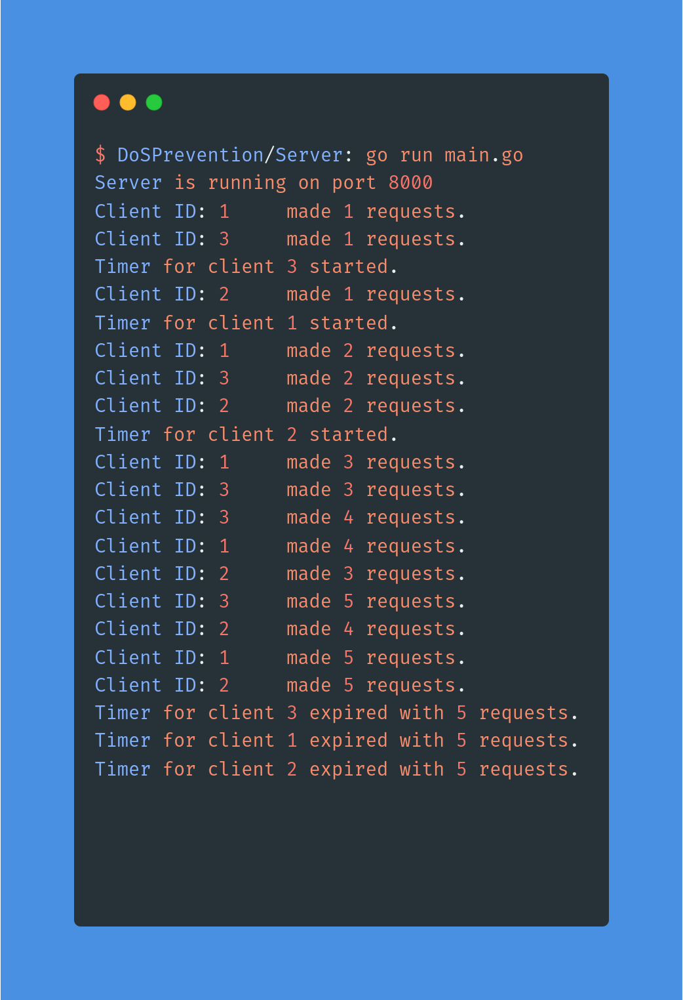
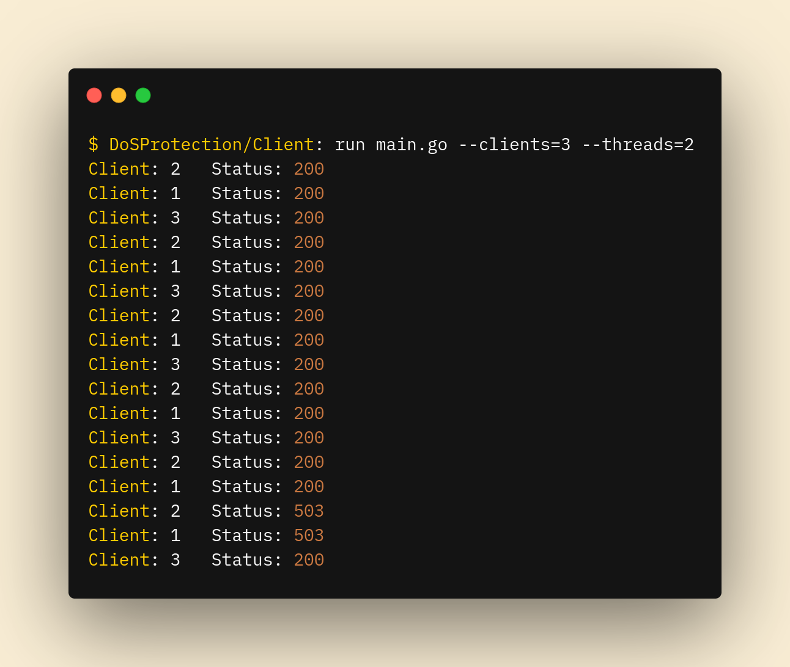

<div id="top"></div>

<br />
<div align="center">

<h3 align="center">Simple Denial-of-service server<br> and testing client</h3>

  <p align="center">
    This repository contains a simple HTTP server and client both written in Go programming language.<br>
    The server incorporates the timer for each of the clients and posses a request limit on it.
    <br />
    <br />
    <br />
  </p>
</div>


<!-- ABOUT THE PROJECT -->
## About The Project

The purpose of this project was to learn more about concurrency and the inner workings of Go programming language.

### The concepts I learned during
- Concurrency. Using go routines to handle a lot more work simultaneously.
- Channels. Using channels to communicate between different go routines.
- Locks. When dealing with multiple go routines the thread safty is important.
- Pointers. How the variables can be accessed dirrectly in memory using pointers.


### Built With

* [Go](https://go.dev/)

<p align="right">(<a href="#top">back to top</a>)</p>

### Installation

1. Clone the repo
   ```sh
   git clone https://github.com/RokZabukovec/DoSProtection
   ```
2. Build the executable
   ```sh
   go build main.go
   ```
3. Change the execution rights
    ```sh
    sh chmod +x ./main.go
    ```
4. Run the exetuable
   ```sh
   ./main
   ```
4. For help use 
   ```sh
   ./main --help
   ```
<p align="right">(<a href="#top">back to top</a>)</p>


<!-- USAGE EXAMPLES -->
## Usage


<!-- CONTACT -->
## Contact

Rok Zabukovec - [@RZabukovec](https://twitter.com/RZabukovec) - rok.zabukovec.it@gmail.com

Project Link: [https://github.com/RokZabukovec/DoSProtection](https://github.com/RokZabukovec/DoSProtection)

<p align="right">(<a href="#top">back to top</a>)</p>